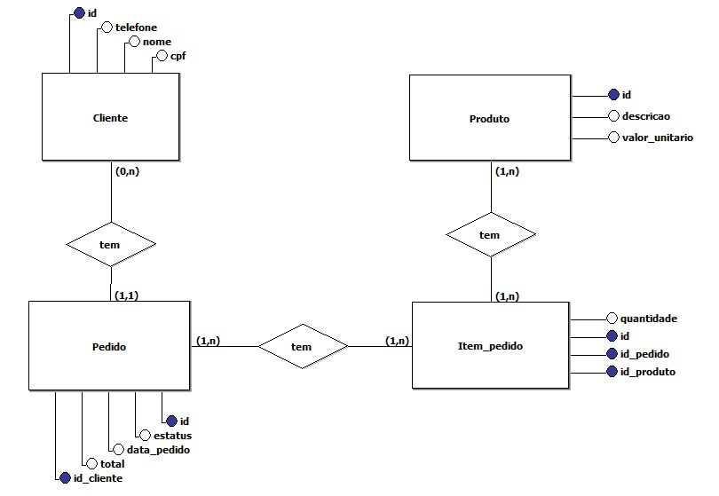

# APIRestful-ecommerce

## Aqui ficará parte da documentação do projeto, onde deixarei claro as tecnologias aplicadas, design, padrões e etc.

### Projeto inicializado usando o [Spring Initializr](https://start.spring.io/)

Neste projeto, será desenvolvido uma APIRestful, para gerenciamento das vendas de um Ecommerce, onde o diagrama
conceitual e cardinalidades, foram elaborados como mostra a imagem abaixo.

* Este projeto tem as dependências do Lombok, SpringBoot Dev Tools, JPA Repositories, SpringWeb e H2 DataBase.

* Será usado JPA e o H2 Database, para persistir os dados do projeto.

* Criada a estrutura do projeto e suas camadas de domain, entity, controller, service, dto, repositories, impl, exception e etc.