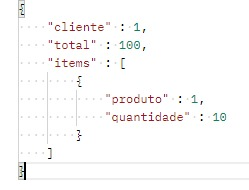

# APIRestful-ecommerce ‍💻

## Aqui ficará parte da documentação do projeto, onde deixarei claro as tecnologias aplicadas, design, padrões e etc.

### Projeto inicializado usando o [Spring Initializr](https://start.spring.io/) 🍃

#### Neste projeto, será desenvolvido uma APIRestful, para gerenciamento das vendas de um Ecommerce, onde o diagrama conceitual e cardinalidades, foram elaborados como mostra a imagem abaixo.

#

## Este projeto tem as seguintes dependências: 

 
DEPENDÊNCIAS | REFERÊNCIA
------------ | ---------------
SPRING WEB | https://mvnrepository.com/artifact/org.springframework/spring-web/5.3.22
LOMBOK | https://mvnrepository.com/artifact/org.projectlombok/lombok/1.18.24
JPA | https://mvnrepository.com/artifact/org.springframework.boot/spring-boot-starter-data-jpa/2.7.1
DEV TOOLS | https://spring.io/blog/2015/06/17/devtools-in-spring-boot-1-3
H2 DATABASE | http://www.h2database.com/html/build.html

 

* Será usado JPA e o H2 Database, para persistir os dados do projeto.

* A camada ***domain***, é onde terá as entidades da API, onde acontece o  mapeamento e relacionamento delas, baseados no diagrama já elaborado acima.

* A camada de ***exception*** é onde está as exceções personalidas da nossa API.

* A camada de ***repositories***, segue o padrão Repository Pattern, reponsável por abstrair a persistência no banco de dados, com a responsabilidade desacoplada.

* A camada de ***controller***, é a intermediária entre outras camadas, faz o controle dos fluxos, e requisições.

* A camada de ***service***, é a responsável por toda a nossa lógica da regra de negócio.

* A camada de ***dto*** (*****DATA TRANSFER OBJECT*****) ele usa de um objeto mais simples, na aplicação usaremos o formato ***JSON***. **(terá uma imagem exemplo abaixo)** para transferir dados de um local a outro na aplicação, sem necessidade de regra de negócio em seus objetos, perceba que não precisamos explicitamente chamar todos os atributos dos objetos, e através do id, ele já abstrai a complexidade da transferência.

